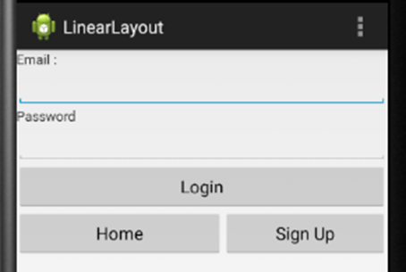
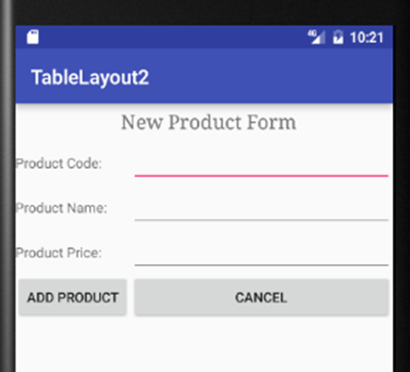
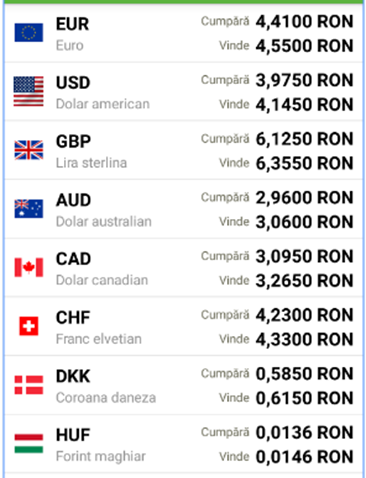

# Android_HF
Android hazik

HF1:

1. Készítsél egy alkalmazást, amelyben a 4 alapműveletet lehet tesztelni két valós szám esetén. A két számot EditText mezőkben visszük be. Az eredmény egy TextView-ban jelenjen meg. A négy műveletre Button widget-et használunk, amelyeknek a feliratai a négy művelet (+, -, *, /). Használjuk a Java-ból ismert kivételkezelést.

------------------------------------------------------------------------------------------------------------------------------------------

HF2:

1.	A 2. feladatot folytatva egészítsük ki egy harmadik Activity-vel, amelyet a második Activity-n elhelyezett gombbal lehet megjeleníteni. Itt is írjuk felül a callback üzeneteket, majd figyeljük a LogCat ablakban az üzeneteket (Home, Back gombok, elforgatás, stb.).

2.	Készítsél egy ActivityStateSaveTwo nevű alkalmazást. Helyezzél egy EditText és Checkbox elemet az activity-re (android:saveEnabled=“false”). Tanulmányozzad az állapot elmentést és visszaállítást a fenti két elem esetén.

------------------------------------------------------------------------------------------------------------------------------------------

HF3:

1.	Készítsd el az alábbi ábrán látható felületet LinearLayout nézet segítségével. Használt widgetek: TextView, EditText, Button.

2.	Készítsd el az alábbi felületet TableLayaout-ot és ConstrainLayout-ot használva. Az „Add product” gombra kattintva mindig létrehozunk egy Product példányt (a Product osztályt létre kell hozni), majd betesszük egy listába. A „Cancel” gomb törli a mezők tartalmát. Tegyünk egy „Show products” gombot, amelyre kattintva egy TextView elemben megjelenítjük valamennyi Product-ot a listából. 

------------------------------------------------------------------------------------------------------------------------------------------

HF4: 

1.	Készítsünk egy listát (ListView), amelynek egy sora az alábbi ábrán látható. Kattintásra egy lista elemen jelenjen meg a pénznem és a vételi ár. A listaelemek nézete ConstraintLayout-ot használjon.

------------------------------------------------------------------------------------------------------------------------------------------

HF5:

